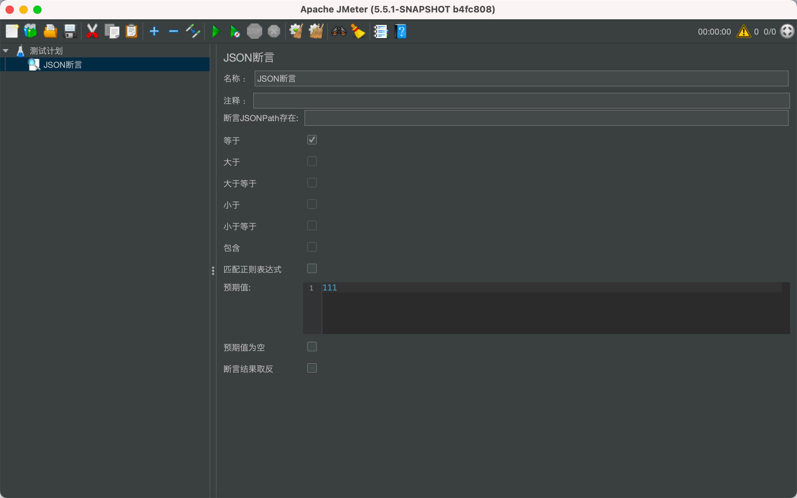
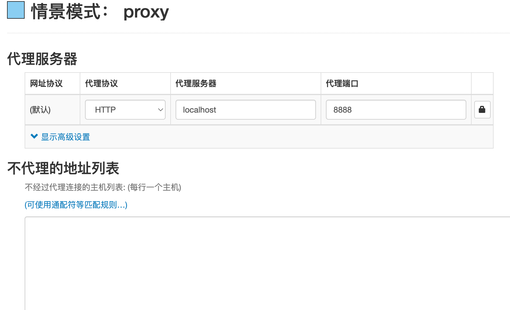
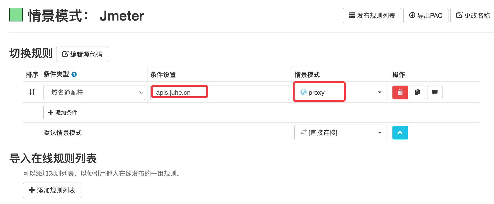
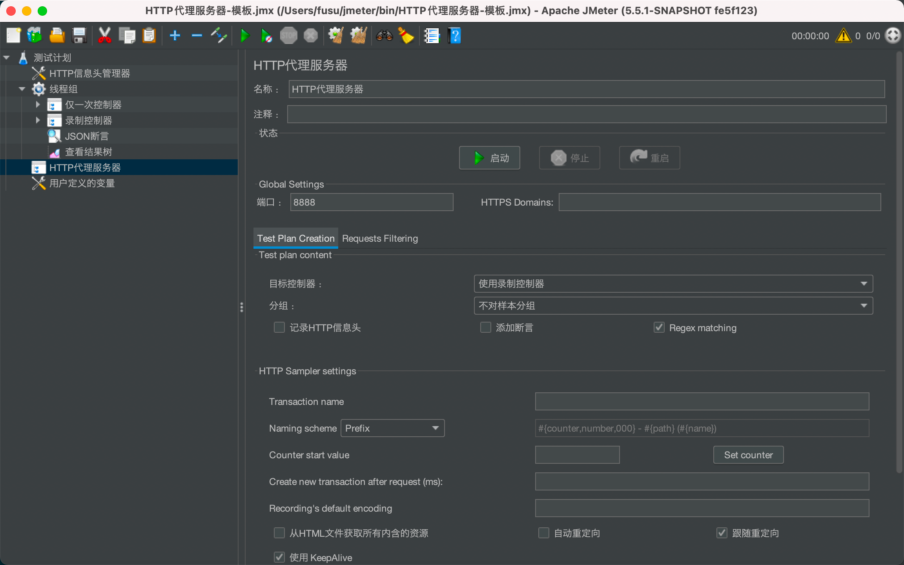
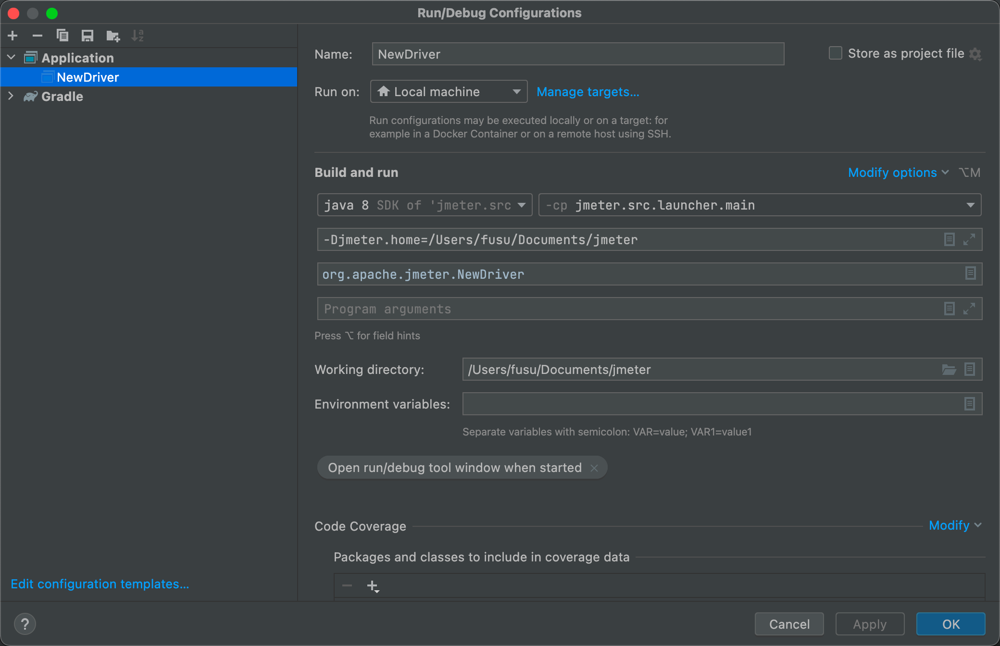
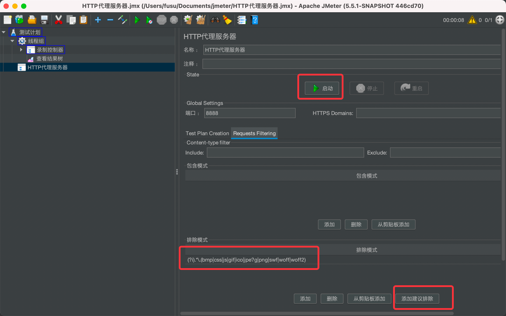
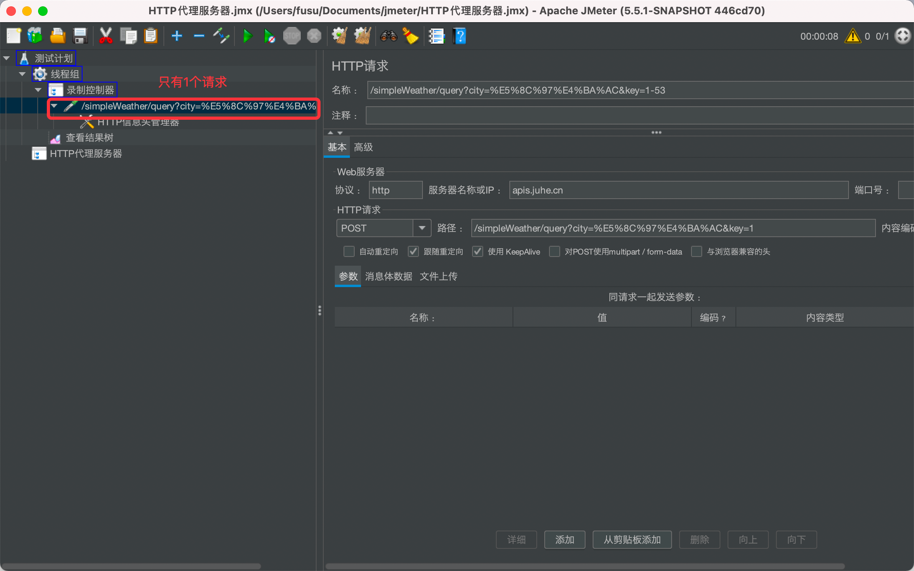
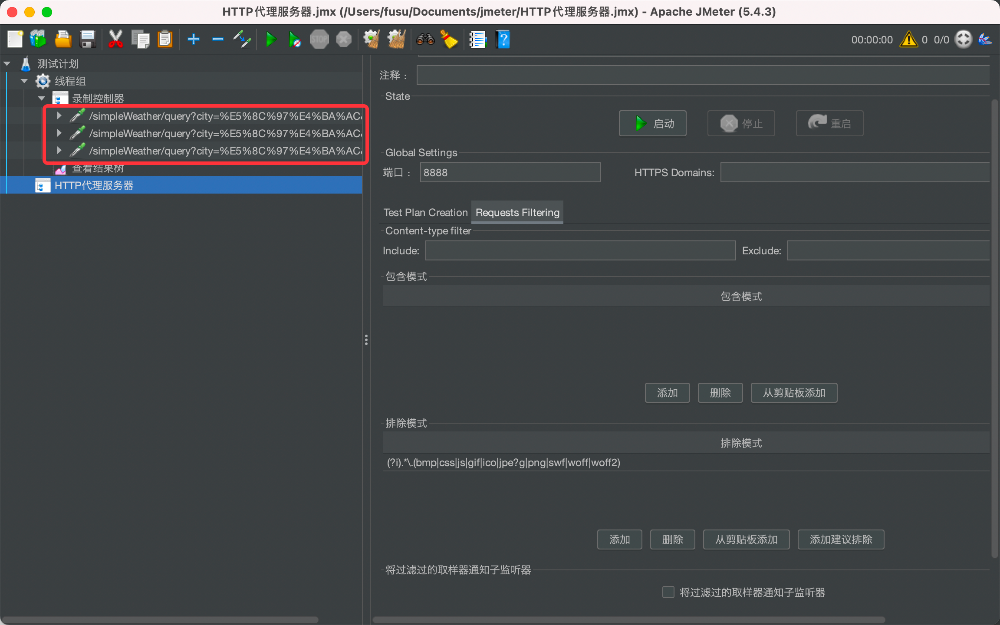
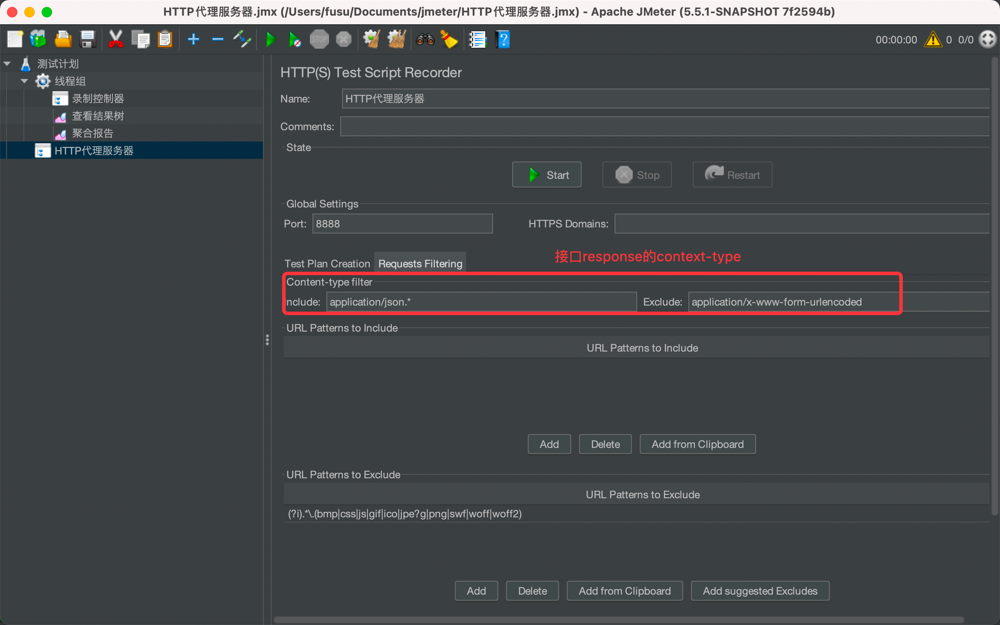
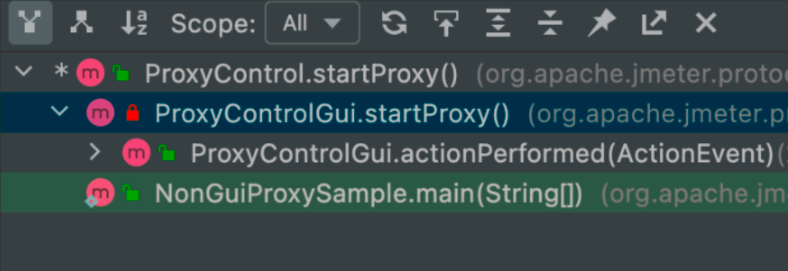

## 新增功能:
- HTTP录制支持去重：根据method、url、parameter去重
- json断言支持大于、大于等于、小于、小于等于，仅支持整数，小数
- json断言支持包含，仅支持字符串

以下操作均在Macos操作系统
 
## HTTP代理服务器去重逻辑，代码改动：
NewDriver.java
### 使这个条件不生效，OS_NAME_LC.startsWith("mac os x")

ProxyControl.java

### 存放一次录制中所有请求的基本信息
private List<SimpleHttpRequest> simpleHttpRequests = new ArrayList<>();

### 一次录制中，根据method、url、parameter去重
try {
SimpleHttpRequest simpleHttpRequest = new SimpleHttpRequest(sampler.getMethod(), sampler.getUrl().toString(), sampler.getArguments().toString());
if (!simpleHttpRequests.contains(simpleHttpRequest)) {
simpleHttpRequests.add(simpleHttpRequest);
sampleQueue.add(new SamplerInfo(sampler, testElements, myTarget, getPrefixHTTPSampleName(), groupingMode));
}
} catch (MalformedURLException e) {
e.printStackTrace();
}

### 清空集合
simpleHttpRequests.clear();

### 安装chrome浏览器插件：SwitchyOmega

### 指定录制域名使用代理：localhost:8888

## IDEA启动
### 双击createDist

### 配置-Djmeter.home为项目根目录

### 右键启动
NewDriver.main()

## 二进制启动
sh bin/jmeter.sh

## 打包
tar -czf jmeter-bin.tar.gz bin lib

## 开始录制

### 同一个接口请求多次
1、改造后的jmeter只录制一份

2、原生jmeter录制多份

## http录制样本
jmeter/blob/master/HTTP代理服务器.jmx

## HTTP代理服务器调用栈：

