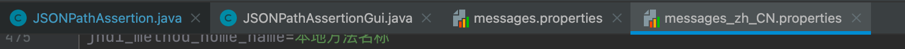

## 新增功能:
<li>HTTP代理服务器：一次录制过程中，根据method、url、parameter去重
<li>json断言，大于某个数字，支持整数和小数点(小数点位数最长支持10位)

 

以下操作均在Macos操作系统
 
## HTTP代理服务器去重逻辑，代码改动：
NewDriver.java
 
### 使这个条件不生效，OS_NAME_LC.startsWith("mac os x")

ProxyControl.java
 
### 存放一次录制中所有请求的基本信息
 
private List<SimpleHttpRequest> simpleHttpRequests = new ArrayList<>();
 
### 一次录制中，根据method、url、parameter去重
 
try {
SimpleHttpRequest simpleHttpRequest = new SimpleHttpRequest(sampler.getMethod(), sampler.getUrl().toString(), sampler.getArguments().toString());
if (!simpleHttpRequests.contains(simpleHttpRequest)) {
simpleHttpRequests.add(simpleHttpRequest);
sampleQueue.add(new SamplerInfo(sampler, testElements, myTarget, getPrefixHTTPSampleName(), groupingMode));
}
} catch (MalformedURLException e) {
e.printStackTrace();
}
 
### 清空集合
simpleHttpRequests.clear();
 
### 安装chrome浏览器插件：SwitchyOmega
 
### 指定录制域名使用代理：localhost:8888

##【1】IDEA启动：
--双击createDist

 
--配置-Djmeter.home为项目根目录

--右键启动
NewDriver.main()
 

##【2】二进制启动
sh bin/jmeter.sh

##【3】开始录制

### 同一个接口请求多次
1、改造后的jmeter只录制一份

 
2、原生jmeter录制多份
 

## HTTP代理服务器调用栈：

