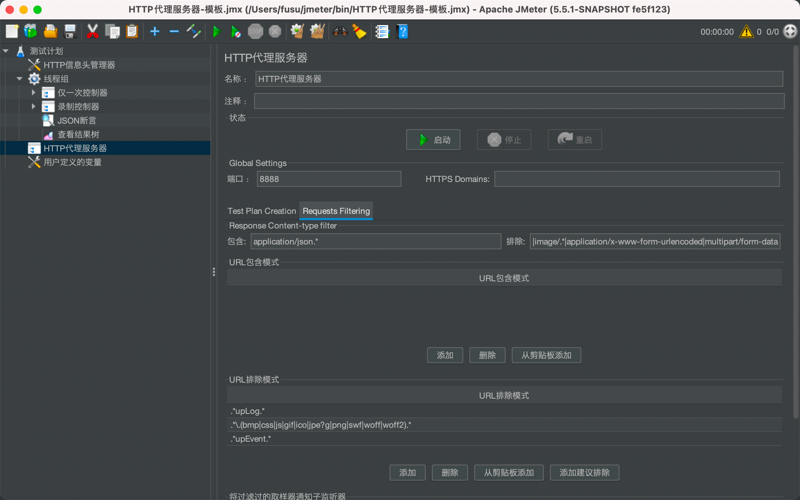

## 新增功能
- HTTP录制支持去重：根据method、url、parameter去重
- json断言支持大于、大于等于、小于、小于等于，仅支持整数，小数
- json断言支持包含，仅支持字符串
- json断言支持降噪处理，通过配置jsonpath，过滤掉干扰字段比如时间搓、随机数等，提高断言成功率

### HTTP代理服务器

### JSON断言

https://github.com/json-path/JsonPath

